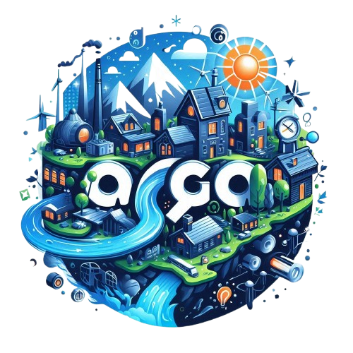

# AGO  

## AutoGuided Onboarding WebApp for Carbon Footprint Reduction  

## Background  

The AutoGuided Onboarding webApp (AGO) combines Azure OpenAI capabilities with sustainability tracking to help organizations reduce their carbon footprint. This CLI-to-WebApp transition project provides:  
- AI-powered energy bill analysis  
- Smart sustainability recommendations  
- Progress tracking dashboard  
- Automated reporting (future scope)  

### Core Integration  
```diff
+ Azure OpenAI API for natural language processing  
+ Energy consumption pattern recognition  
+ ROI calculation engine for green initiatives  
```

---

## Project Structure  

```
AGObot/
├── frontend/ AGOchatbot      # WebApp interface (Mockup)
│   ├── pages/  
│   │   ├── index.html        # Mockup design   
│   │   └── setup.md          # Setup instructions
│   │   └── requirements.txt  # package installation instructions
│   │   └── agoCLIoutput.md   # Main App data outputs
│   │   └── vTrackerOutput.md # Visual tracker App data outputs
│   └── IMG                   # Project images
│   └── components/  
│       └── energybill.json   # EEHC grid data
|       └── impactchart.json  # Data for graphs and charts
|       └── promptinj.json    # Data Prompts for chatbot
├── backend/                  # Current CLI implementation  
│   ├── ago.py                # Main application: Calc energybill.json & recommend 
│   ├── vtracker.py           # Create graphs and charts from impactchart.json
│   └── data_models/          # GPT 4.0    
├── docs/  README.md          # Documentation         
└── tests/ app.py             #Azure web services
    └── integrations.js/      # Python data Integration 
```

---

## Readme Content  

This project combines:  
- **CLI Application** (Current Implementation)  
- **Web Interface** (Planned Development)  
- **AI Integration** (Azure OpenAI)  
- **Sustainability Analytics**  
- **Satellite Data Pipeline** (Future Roadmap)  

---

## Wireframe Design  

### CLI Interface (Current)  
```
+---------------------------------+
| Carbon Footprint Reduction CLI  |
|---------------------------------|
| 1. Set Sustainability Goal      |
| 2. Process Energy Bill          |
| 3. View Recommendations         |
| 4. Exit                         |
+---------------------------------+
```

### Web Dashboard (Planned)  
```
+---------------------------------+
| Web Dashboard                   |
|---------------------------------|
| Real-time Carbon Metrics        |
| AI Recommendations Panel        | 
| Energy Cost Projections         |
| Sustainability Progress Chart   |
+---------------------------------+
```

---

## Prototype  

1. **Current MVP**: Functional CLI version with:  
   - Azure OpenAI integration  
   - Energy bill processing  
   - Basic recommendation engine  

2. **Web Interface Prototype**:  
   Interactive mockup available [here](http://aimtyaem.github.io/AGO) (to be implemented)

   [AGO chatbot](https://aimtyaem.github.io/AGO/index.html) track and monitor mockup.

---

## Mockup Design  

- **CLI Workflow Mockup**  
- **Web Dashboard Concept**  
- **Mobile Analytics Preview**  
- **Satellite Integration Preview**  

---

## Development Requirements  

| Category        | Requirements                          |
|-----------------|---------------------------------------|
| Core            | Python 3.10+, Azure OpenAI access     |
| CLI Dependencies| openai, python                        |
| Web Components  | AI Chat-based WebApp                  |
| Data Science    | pandas, numpy, scikit-learn           |
| DevOps          | Azure, GitHub Actions                 |

---

## Getting Started  

1. **Clone Repository**  
```bash
git clone https://github.com/<your-repo>/carbon-footprint-app.git
cd carbon-footprint-app
```

2. **Install Dependencies**  
```bash
pip install -r requirements.txt
```

3. **Configure Environment**  
```bash
echo "AZURE_OPENAI_API_KEY=your_key_here" > .env
echo "AZURE_OPENAI_ENDPOINT=your_endpoint_here" >> .env
```

4. **Run CLI Application**  
```bash
python ago.py
python vtracker.py
```

---

## Contribution Guidelines  

### Development Streams  
1. **CLI Enhancements**  
   - Add database integration  
   - Implement report generation  

2. **Web Interface**  
   - Develop Flask/Django backend  
   - Create React frontend  

3. **OpenAI Integration**  
   - Azure openAI service  
   - GPT 4.0 model  

---

## Code of Conduct  

All contributors must adhere to:  
- Open-source collaboration principles  
- Environmental data ethics guidelines  
- Microsoft Azure AI ethics standards  

---

## Contact  

**Project Maintainer**  
Ahmed Ibrahim Metawee  
Email: [aimt16@hotmail.com](mailto:aimt16@hotmail.com)  
GitHub: [@aimtyaem](https://github.com/aimtyaem)  

---

## License  

This project is dual-licensed under:  
- [MIT License](https://opensource.org/licenses/MIT) for code  
- [CC BY-NC 4.0](https://creativecommons.org/licenses/by-nc/4.0/) for documentation  

---

## Resources  

1. [Azure OpenAI Documentation](https://learn.microsoft.com/en-us/azure/ai-services/openai/)  
2. [Climate Action Tracker API](https://climateactiontracker.org/)  
3. [Satellite Data Processing Guide](https://aws.amazon.com/ground-station/)  

---

*Empowering sustainable decisions through AI-driven insights - From CLI to orbital integration.*  
